# 🌿 Kisan AI — Smart Crop Advisor v2

**AI-powered, profit-first farming advisory system for Indian farmers**  

---

## ✨ What's New in v2

| Feature | v1 | v2 |
|---|---|---|
| Crop Recommendation | ✅ | ✅ |
| Fertilizer Advisor | ✅ | ✅ |
| Disease Detection | ✅ | ✅ |
| Market Prices (static) | ✅ | ✅ |
| **6-Month Price Forecast** | ❌ | ✅ Prophet AI |
| **AI Chatbot (Kisan AI)** | ❌ | ✅ Claude / rule-based |
| **Multilingual (9 langs)** | ❌ | ✅ Hindi, Telugu, Tamil… |
| **7-Day Weather Forecast** | ⚠️ Current only | ✅ Daily farm alerts |
| **PWA Mobile Install** | ❌ | ✅ Works offline |

---

## 🧠 AI Models

| Model | Algorithm | Accuracy | Dataset |
|---|---|---|---|
| Crop Recommendation | Random Forest | 99.3% | 2200 rows, 22 crops |
| Fertilizer Recommendation | Random Forest | 100% | 99 rows, 7 fertilizers |
| Disease Detection | MobileNetV2 | ~95% | PlantVillage, 16 classes |
| Market Forecast | Prophet (Meta) | — | 4 years monthly data |

---

## 🚀 Quick Start

### 1. Install dependencies
```bash
pip install -r requirements.txt
```

### 2. Train models (first time only)
```bash
# Train crop & fertilizer models
python notebooks/train_models.py

# Train market price prediction
python notebooks/train_market_predictor.py
```

### 3. Start API server
```bash
cd api
uvicorn main:app --reload --port 8001
# → http://localhost:8001
```

### 4. Open the app
Open `frontend/index.html` in browser, or the backend serves it at `http://localhost:8001`

---

## 📁 Project Structure

```
smart-crop-advisor-v2/
├── api/
│   ├── main.py                ← FastAPI app (11 endpoints)
│   ├── chatbot.py             ← AI chatbot (Claude + fallback)
│   ├── translator.py          ← 9-language support
│   ├── market_predictor.py    ← 6-month price forecast
│   └── weather_forecast.py    ← 7-day weather + farm alerts
├── models/
│   ├── crop_model.pkl
│   ├── fertilizer_model.pkl
│   ├── disease_model.h5       ← add after training
│   ├── market_prophet_models.pkl
│   └── market_forecasts_cache.json
├── data/
│   └── market_prices_historical.csv
├── notebooks/
│   ├── train_models.py
│   └── train_market_predictor.py
├── frontend/
│   ├── index.html             ← Complete SPA (9 pages)
│   └── manifest.json          ← PWA manifest
├── requirements.txt
├── render.yaml                ← Render.com deployment
└── README.md
```

---

## 🌐 API Endpoints

```
GET  /health                 → server status
GET  /languages              → supported languages list
POST /predict/crop           → crop recommendation + profit
POST /predict/fertilizer     → fertilizer recommendation
POST /predict/disease        → leaf disease detection
GET  /market/price           → current MSP price
GET  /market/forecast        → 6-month AI price forecast  ← NEW
GET  /weather                → current weather
GET  /weather/forecast       → 7-day forecast + alerts    ← NEW
POST /chat                   → AI chatbot (Kisan AI)       ← NEW
POST /translate              → translate any text          ← NEW
```

---

## 🌍 Supported Languages

English · हिंदी · తెలుగు · தமிழ் · ಕನ್ನಡ · मराठी · বাংলা · ગુજરાતી · ਪੰਜਾਬੀ

---

## ☁️ Deployment

### GitHub Pages (Frontend)
Push to GitHub → Settings → Pages → Source: `/frontend`

### Render.com (Backend) — Free
1. Connect GitHub repo
2. Root directory: `api`
3. Build: `pip install -r ../requirements.txt`
4. Start: `uvicorn main:app --host 0.0.0.0 --port $PORT`
5. Add env vars: `ANTHROPIC_API_KEY`, `OPENWEATHER_API_KEY`

### Hugging Face Spaces (Recommended — Free + ML-optimized)
1. New Space → Gradio or Docker
2. Push entire repo
3. Set secrets for API keys

---

## 📱 PWA Installation

**Android:** Open in Chrome → Menu → "Add to Home Screen"  
**iPhone:** Open in Safari → Share → "Add to Home Screen"  
Opens fullscreen like a native app — no app store needed!

---

## 🔑 API Keys Required

| Service | Purpose | Free Tier |
|---|---|---|
| [OpenWeatherMap](https://openweathermap.org/api) | Weather data | 60 calls/min |
| [Anthropic](https://console.anthropic.com) | AI chatbot (optional) | Pay per use |

> Without Anthropic key, chatbot uses built-in rule-based responses — still works!
>
## Application Screenshots

### Landing Page
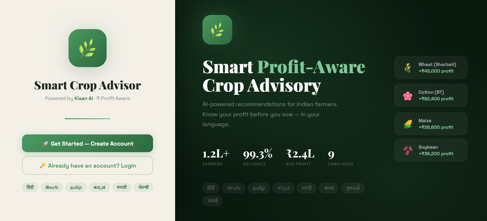

### Dashboard
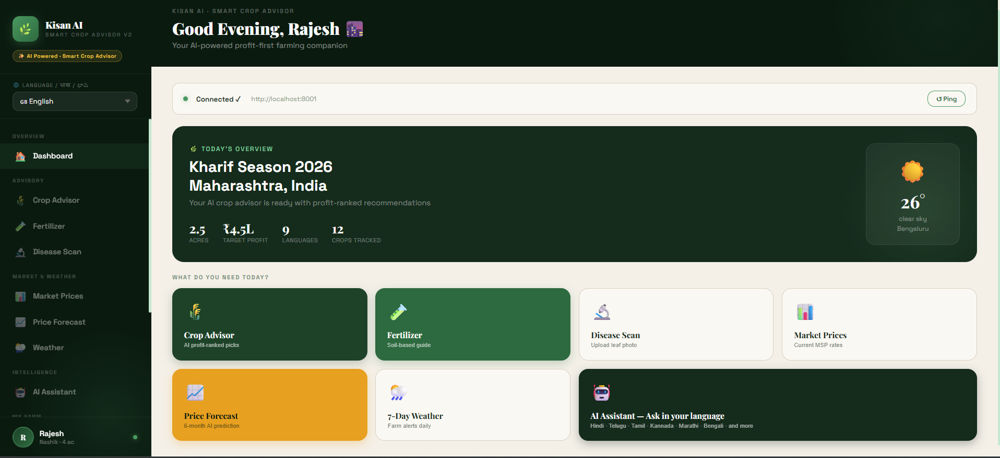

### Account Creation
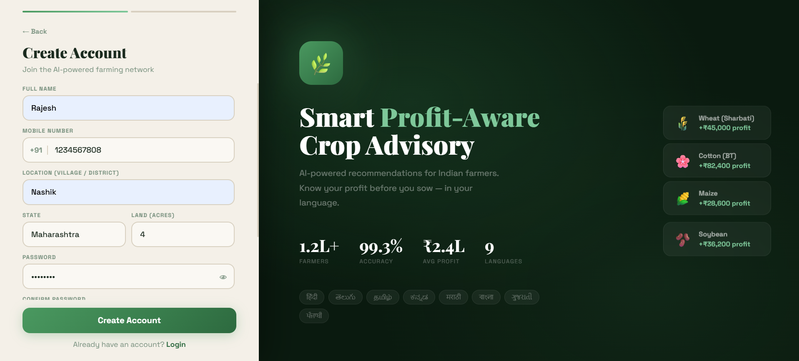

### Crop Advisor
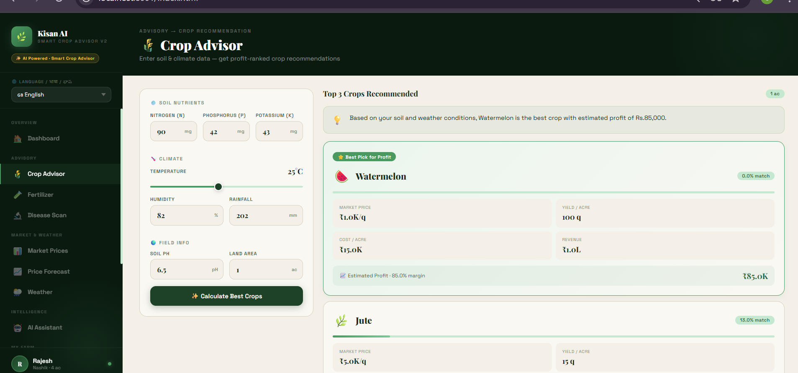

### Fertilizer Recommendation
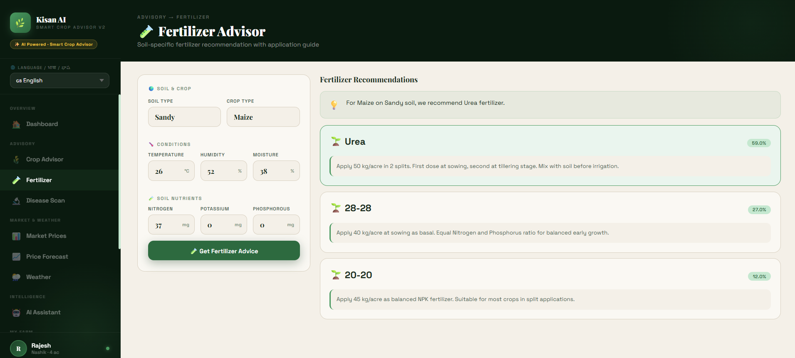

### Disease Detection
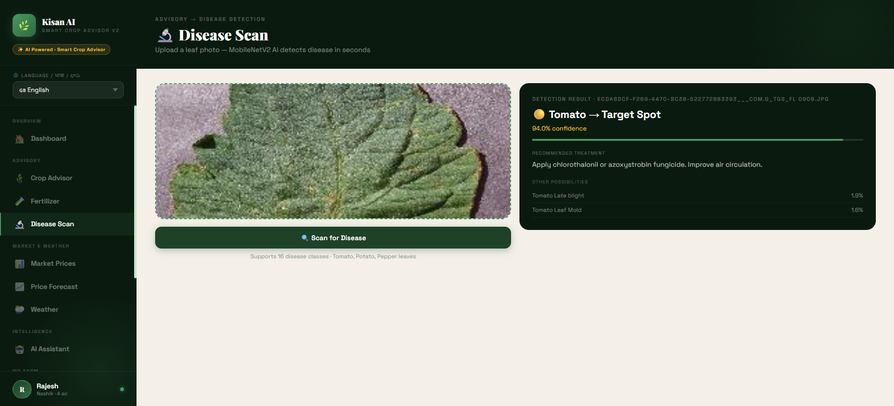

### Market Prices
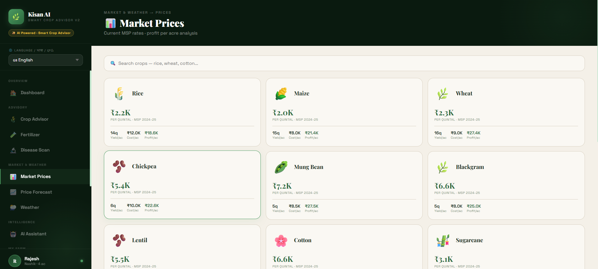

### Price Forecast


### Weather Forecast
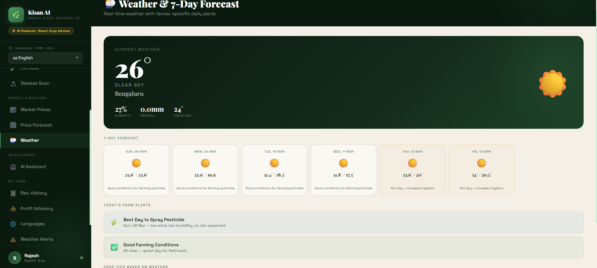

### AI Assistant
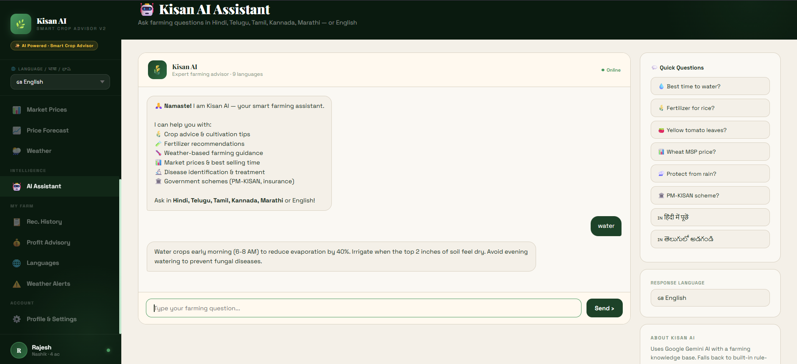

### Recommendation History
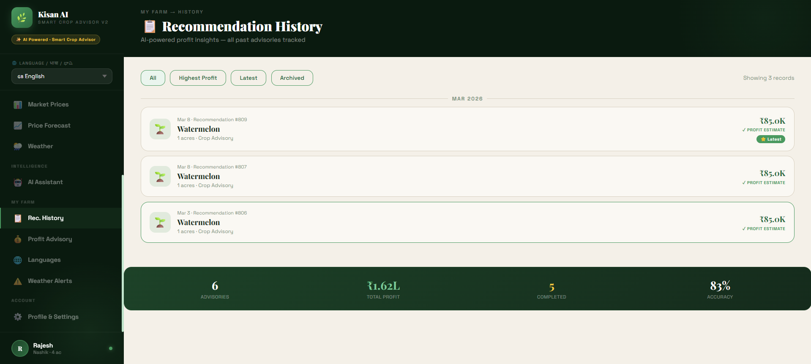

### Profit Advisory
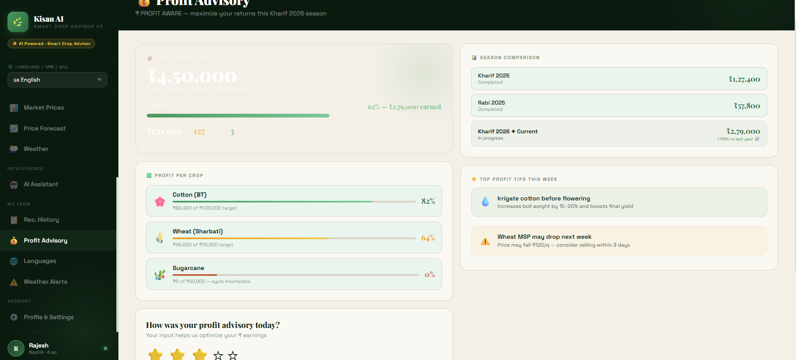

### Language Translation
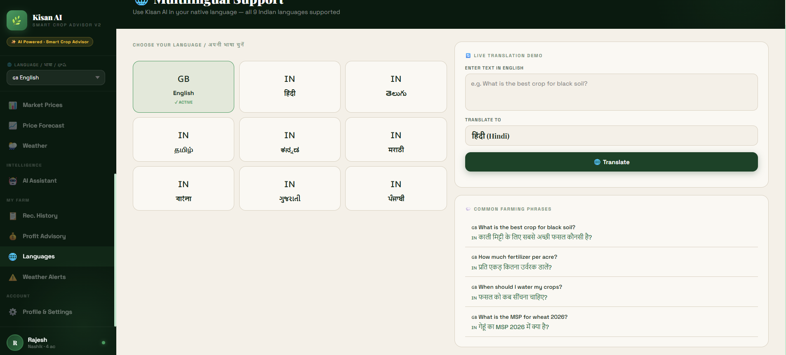

### Weather Alerts
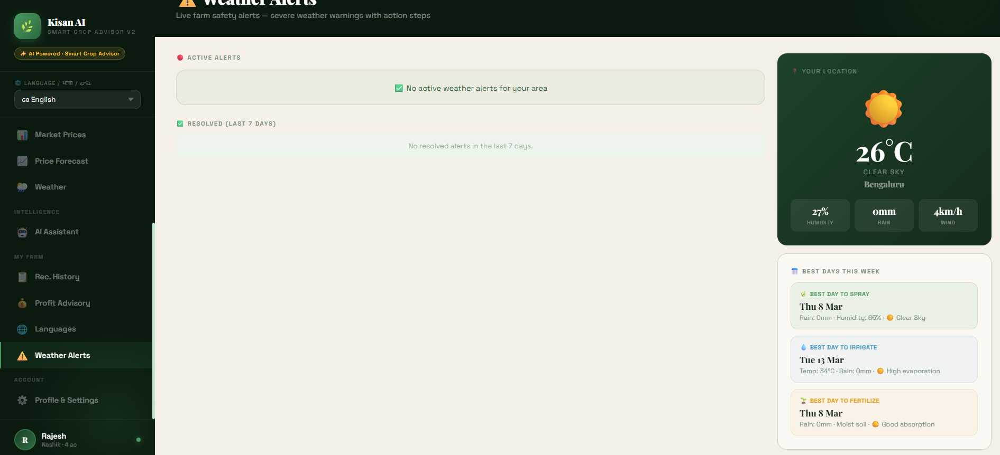

### Profile and Settings
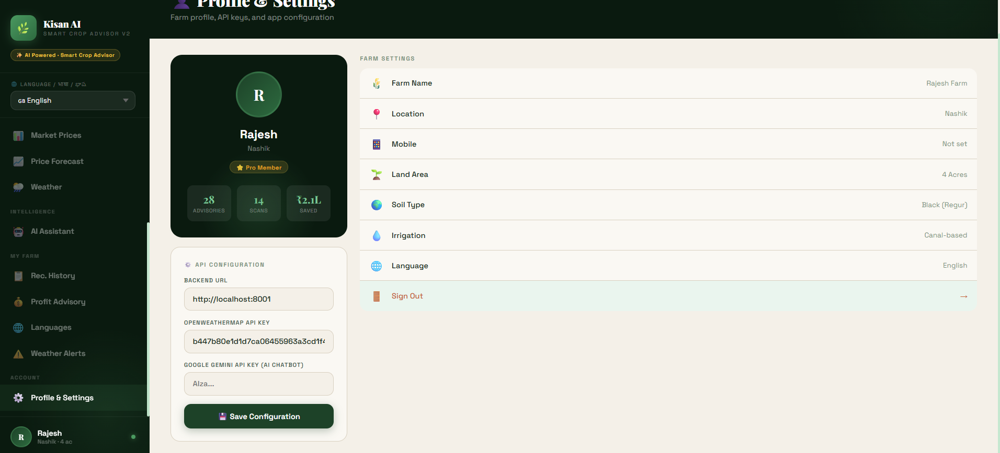
